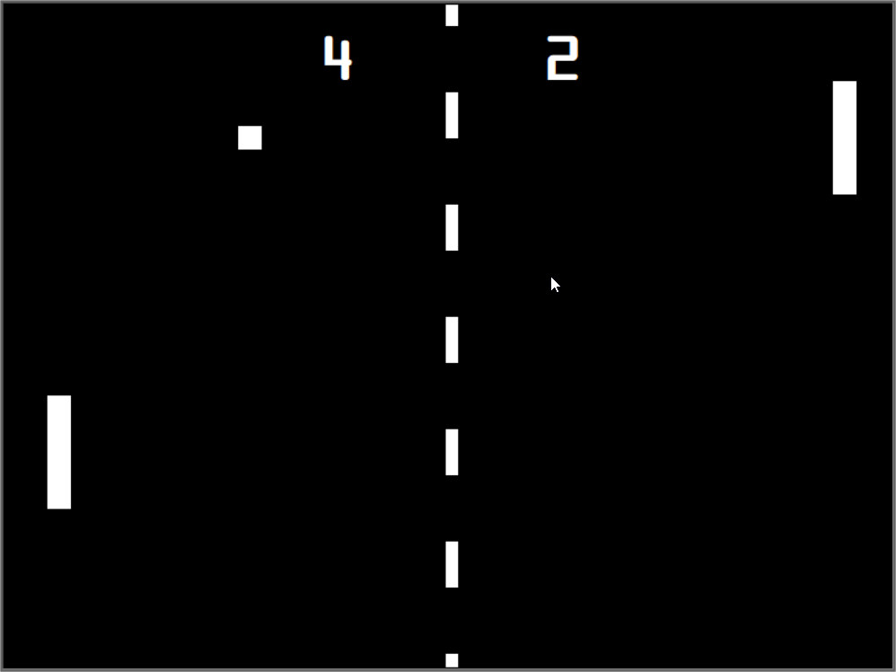
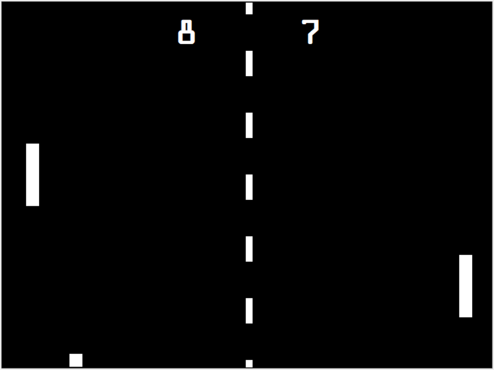

# Python Pong Game with Turtle Graphics

## Description

Retro 2 Player Pong Game but with Turtle Graphics in Python 3.10.

This Program was once again written to help me understand Object Orientated Programming a bit better.

Move the left and right paddles up and down to keep the other player from scoring, the ball will also increase in speen every time the paddle hits it. If you miss the ball your opponent will score

## How to Use/Run

This was writen in Python 3.10 so should run fine on your system if you have python 3.10 installed

Simply run main.py

Basic Controls are:

- Up and Down for Right Paddle
- W and S for Left Paddle

### Additional modules needed

- None (No additional modules were used)

### Game Features

- 2 Player on 1 Keyboard
- Progresive dificulty
- Keeps Score
- Keeps Playing the game until you exit

### Screenshots

### Files Included

ball.py

- implements the ball class

main.py

- this is the main game loop and the table

paddle.py

- Implements the paddle based on player number
- When initializing the Class you should specify for player 1 or 2

score.py

- Implement the UI Score element
- When initializing the Class you should specify for player 1 or 2
